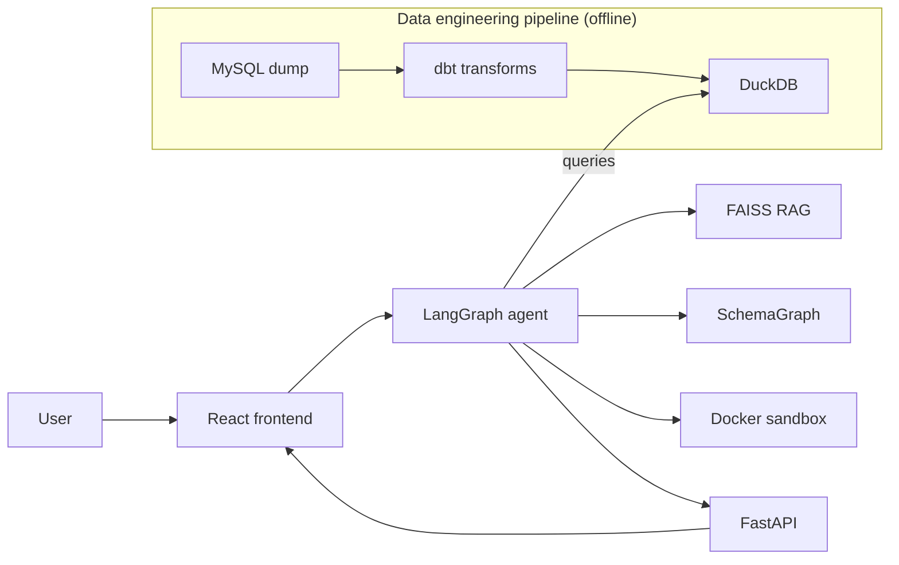

<div align="center">

# CaliperLens
</center>

<center>
<p>
    
    
    
    
    
    
    
</p>
</center>

An agentic natural-language-to-SQL engine for querying complex healthcare datasets autonomously. Uses a multi-agent sandboxed workflow to reason through database schemas and generate complex queries.

<div align="left">

## Getting Started

```bash
git clone https://github.com/Eros483/CaliperLens.git
cd CaliperLens
cp .env.example .env
```

Set your `.env` with the required keys (see `.env.example`).

```bash
make setup    # Install all dependencies
make dev      # Start frontend + backend
make test     # Run all tests
make style    # Format + lint
```

For the complete architecture — agent graph, tools exposed to the LLM, guardrails, data pipeline, and infra — see [docs/design.md](docs/design.md).

## System Flow

The diagram shows the two pipelines that keep CaliperLens running: the **offline data pipeline** (MySQL → DuckDB, scheduled by Airflow) and the **online query pipeline** (user question → validated answer).



## Directory Overview

```
├── backend/               # FastAPI + LangGraph agent
│   ├── api/v1/            # Versioned route handlers (thin)
│   ├── core/              # Business logic (auth, sandbox, analysis, planner, tiers)
│   ├── src/               # Agent internals
│   │   ├── agent.py           # Main LangGraph Agent definition
│   │   ├── custom_tools.py    # Tools exposed to the LLM
│   │   ├── graph_manager.py   # NetworkX logic for join path discovery
│   │   ├── prompt_module.py   # System prompts for agent states
│   │   └── rag_manager.py     # FAISS vector store for schema search
│   ├── schemas/           # Pydantic request/response models
│   ├── utils/             # Config, logger, exceptions
│   ├── tests/             # test_api/ + test_core/ (mirror module layout)
│   └── main.py            # FastAPI entry point
│
├── frontend/              # React + Vite + TS chat UI
│   ├── src/
│   │   ├── components/    # ChatInterface, ChatMessage, ChatInput
│   │   ├── store/         # Zustand chat state
│   │   ├── services/      # API call functions
│   │   └── __tests__/     # Vitest component tests
│   ├── public/
│   ├── index.html
│   └── (vite.config.ts, tsconfig.json, package.json)
│
├── dbt/                   # dbt project: staging → intermediate → marts
│   └── models/
│       ├── staging/       # 1:1 MySQL mirrors (views)
│       ├── intermediate/  # pre-computed joins (tables)
│       └── marts/         # analytics-ready models (tables)
│
├── airflow/               # Airflow DAGs + docker-compose for dbt scheduling
├── sandbox/               # Docker image for isolated code execution
├── eval/                  # NL-to-SQL eval harness (questions.json + runner.py)
├── grafana/               # Grafana dashboard provisioning
├── docs/
│   ├── problem.md         # Original problem statement
│   ├── design.md          # Architecture & design document
│   └── features.json      # Feature tracker
│
├── Makefile               # Single entry point for setup/dev/test/style/build
├── docker-compose.yaml    # Backend + Prometheus + Grafana
├── prometheus.yml
└── Dockerfile
```

## License

BUSL-1.1 — free for personal, educational, and portfolio use. Production or commercial deployment requires a separate license. See [LICENSE](LICENSE).
